# План редизайна панели администрирования

## 1. Обзор

Текущая страница `/admin/index.vue` содержит 3 кнопки для добавления сущностей (новости, работа в магазин, работа в галерею) и отдельную страницу `/admin/reviews.vue` для модерации отзывов.

**Цель:** Превратить админ-панель в полноценный дашборд управления всем сайтом: галереей, магазином, новостями, мастер-классами, курсами, пользователями, заказами, отзывами, чатами, промокодами и системными справочниками.

---

## 2. Архитектура админ-панели

### 2.1. Структура роутинга

```
/admin/                    # Дашборд (главная)
/admin/gallery/            # Список работ галереи + управление
/admin/gallery/add         # Добавить работу (существует)
/admin/gallery/edit/[id]   # Редактировать работу (существует)
/admin/shop/               # Список товаров магазина + управление
/admin/shop/add            # Добавить товар (существует)
/admin/shop/edit/[id]      # Редактировать товар (существует)
/admin/news/               # Список новостей + управление
/admin/news/add            # Добавить новость (существует)
/admin/news/edit/[id]      # Редактировать новость (существует)
/admin/courses/            # Управление курсами
/admin/courses/add         # Создать курс
/admin/courses/edit/[id]   # Редактировать курс
/admin/master-classes/     # Управление мастер-классами
/admin/master-classes/add  # Создать мастер-класс
/admin/master-classes/edit/[id] # Редактировать мастер-класс
/admin/lessons/            # Управление уроками (по продукту)
/admin/lessons/add         # Создать урок
/admin/lessons/edit/[id]   # Редактировать урок
/admin/users/              # Список пользователей
/admin/users/[id]          # Детали пользователя
/admin/reviews/            # Модерация отзывов (существует)
/admin/purchases/          # Список покупок/заказов
/admin/payments/           # Платежи
/admin/promo-codes/        # Промокоды
/admin/chats/              # Чаты поддержки
/admin/categories/         # Категории продуктов
/admin/tags/               # Теги
/admin/settings/           # Системные справочники (материалы, основы)
```

### 2.2. Компонентная структура

```
client/app/components/admin/
├── AdminLayout.vue              # Общий лейаут админки (сайдбар + хедер + контент)
├── AdminSidebar.vue             # Боковое меню навигации
├── AdminHeader.vue              # Верхняя панель (поиск, уведомления, профиль)
├── AdminStatsCard.vue           # Карточка статистики на дашборде
├── AdminTable.vue               # Универсальная таблица с сортировкой/фильтрацией
├── AdminDataTable.vue           # Продвинутая таблица с пагинацией, поиском, фильтрами
├── AdminFormModal.vue           # Модальное окно для форм
├── AdminConfirmDialog.vue       # Диалог подтверждения действий
├── AdminImageUploader.vue       # Загрузчик изображений (drag & drop)
├── AdminStatusBadge.vue         # Бейдж статуса (draft/published/archived)
├── AdminRichEditor.vue          # WYSIWYG редактор для текстов
├── AdminSearchInput.vue         # Поле поиска
├── AdminPagination.vue          # Пагинация
├── AdminFilterBar.vue           # Панель фильтров
├── AdminEmptyState.vue          # Пустое состояние
├── AdminLoadingSkeleton.vue     # Скелетон загрузки
├── AdminNotificationToast.vue   # Уведомления
├── AdminBreadcrumbs.vue         # Хлебные крошки
├── AdminExportButton.vue        # Экспорт данных
├── AdminStatsGrid.vue           # Сетка статистики на дашборде
├── AdminRecentActivity.vue      # Последняя активность
├── AdminQuickActions.vue        # Быстрые действия
├── AdminChartWidget.vue         # Графики (Chart.js или аналоги)
├── AdminLocaleSwitch.vue        # Переключатель языка (RU/EN)
└── AdminThemeToggle.vue         # Переключатель темы (светлая/тёмная)
```

---

## 3. Дизайн и UI/UX

### 3.1. Общая концепция

- **Современный минималистичный дизайн** с акцентом на читаемость и скорость работы
- **Тёмная и светлая темы** с переключением
- **Адаптивность** под все устройства (desktop-first с корректным mobile-view)
- **Поддержка двух языков** (RU/EN) через существующую i18n-систему
- **Анимации и микро-взаимодействия** (hover, transitions, loading states)

### 3.2. Цветовая схема

```css
/* Светлая тема */
--admin-bg: #f0f2f5;
--admin-surface: #ffffff;
--admin-sidebar-bg: #1a1d29;
--admin-sidebar-text: #a0a5b5;
--admin-sidebar-active: #6c5ce7;
--admin-primary: #6c5ce7;
--admin-primary-hover: #5a4bd1;
--admin-success: #00b894;
--admin-warning: #fdcb6e;
--admin-danger: #e17055;
--admin-text-primary: #2d3436;
--admin-text-secondary: #636e72;
--admin-border: #e0e0e0;

/* Тёмная тема */
--admin-bg-dark: #0f1117;
--admin-surface-dark: #1a1d29;
--admin-sidebar-bg-dark: #0a0c12;
--admin-text-primary-dark: #e0e0e0;
--admin-text-secondary-dark: #a0a5b5;
--admin-border-dark: #2d2d3d;
```

### 3.3. Типографика

- **Заголовки:** Inter, 600/700 weight
- **Основной текст:** Inter, 400 weight
- **Моноширинный:** JetBrains Mono (для ID, кодов)
- Размеры: 12px (мелкий), 14px (основной), 16px (крупный), 20px+ (заголовки)

### 3.4. Макет страницы

```
┌─────────────────────────────────────────────────┐
│                   AdminHeader                    │
│  [Бренд] [Поиск] [Уведомления] [Профиль] [🌙]   │
├──────────┬──────────────────────────────────────┤
│          │                                       │
│  Sidebar │          Content Area                 │
│          │                                       │
│  📊 Даш  │   ┌─────────────────────────────┐    │
│  🖼 Гал  │   │   Breadcrumbs > Section      │    │
│  🛒 Маг  │   ├─────────────────────────────┤    │
│  📰 Нов  │   │                             │    │
│  🎓 Курс │   │   Page Content              │    │
│  🎬 МК   │   │                             │    │
│  👥 Польз│   │                             │    │
│  ⭐ Отзыв│   │                             │    │
│  💳 Пок  │   │                             │    │
│  🏷 Промо│   │                             │    │
│  💬 Чаты │   │                             │    │
│  ⚙ Настр │   └─────────────────────────────┘    │
│          │                                       │
└──────────┴──────────────────────────────────────┘
```

---

## 4. Функциональные требования по разделам

### 4.1. 📊 Dashboard (главная страница `/admin/`)

**Карточки статистики (сверху):**
- Всего работ в галерее
- Всего товаров в магазине
- Всего новостей
- Всего пользователей
- Всего мастер-классов / курсов
- Всего отзывов (с выделением ожидающих модерации)
- Всего покупок / выручка (сумма)
- Активных чатов

**Графики:**
- Регистраций пользователей по месяцам
- Продаж по месяцам
- Популярные категории

**Последняя активность:**
- Последние 5 добавленных работ
- Последние 5 отзывов
- Последние 5 покупок
- Последние 5 сообщений в чатах

**Быстрые действия:**
- Добавить работу в галерею
- Добавить товар в магазин
- Добавить новость
- Создать курс/мастер-класс
- Перейти к модерации отзывов

**API эндпоинты (нужно создать на сервере):**
- `GET /api/admin/stats` — возвращает все счетчики
- `GET /api/admin/recent-activity` — последние действия

### 4.2. 🖼 Галерея (`/admin/gallery/`)

**Список работ:**
- Таблица с колонками: ID, Превью, Название (RU/EN), Год, Размер, Тип, Основа, Материалы, Действия
- Фильтры: по типу (живопись/иллюстрация/3D), по основе, по году
- Поиск по названию
- Пагинация
- Bulk actions: удалить несколько, изменить тип

**Действия над работой:**
- Редактировать (ведёт на `/admin/gallery/edit/[id]`)
- Удалить (с подтверждением)
- Просмотреть на сайте

**API (существующие):**
- `GET /works?offset=&limit=` — список
- `DELETE /works/:id` — удаление
- Редактирование через существующую форму

### 4.3. 🛒 Магазин (`/admin/shop/`)

**Список товаров:**
- Таблица: ID, Превью, Название, Цена, Год, Размер, Основа, Действия
- Фильтры: по цене (диапазон), по основе
- Поиск по названию

**Действия:**
- Редактировать (ведёт на `/admin/shop/edit/[id]`)
- Удалить (с подтверждением)
- Снять с продажи / выставить на продажу

**API (существующие):**
- `GET /sales?offset=&limit=` — список
- `DELETE /sales/:id` — удаление

### 4.4. 📰 Новости (`/admin/news/`)

**Список новостей:**
- Таблица: ID, Заголовок, Дата, Превью-изображение, Действия
- Сортировка по дате
- Поиск по заголовку

**Действия:**
- Редактировать (ведёт на `/admin/news/edit/[id]`)
- Удалить (с подтверждением)
- Просмотреть на сайте

**API (существующие):**
- `GET /news?offset=&limit=` — список
- `DELETE /news/:id` — удаление

### 4.5. 🎓 Курсы и 🎬 Мастер-классы (`/admin/courses/`, `/admin/master-classes/`)

**Список продуктов (общая таблица с фильтром по типу):**
- Колонки: ID, Тип (курс/МК), Название (RU), Цена, Статус (draft/published/archived), Сложность, Уроков, Просмотров, Действия
- Фильтры: по статусу, по типу, по сложности, по категории
- Поиск по названию

**Действия:**
- Создать новый курс/МК
- Редактировать
- Изменить статус (опубликовать/в черновик/архивировать)
- Управление уроками (перейти к списку уроков продукта)
- Удалить

**API (существующие):**
- `GET /api/products?type=course&status=` — список курсов
- `GET /api/products?type=masterclass&status=` — список МК
- `POST /api/products` — создание
- `PUT /api/products/:id` — обновление
- `DELETE /api/products/:id` — удаление

**Форма создания/редактирования продукта (новая страница):**
- Название (RU/EN)
- Описание (RU/EN) — WYSIWYG редактор
- Краткое описание (RU/EN)
- Цена (в копейках)
- Длительность (дни)
- Обложка (загрузка изображения)
- Видео-URL
- Статус (draft/published/archived)
- Сложность (beginner/intermediate/advanced)
- Категория (выбор из существующих)
- Теги (мультивыбор)
- Язык (ru/en/both)
- Чекбоксы: is_featured, certificate_available
- Пререквизиты (RU/EN)
- Результаты обучения (RU/EN)
- Максимум студентов
- Дата старта

### 4.6. 📚 Уроки (`/admin/lessons/`)

**Список уроков (по продукту):**
- Выбор продукта из выпадающего списка
- Таблица: ID, Название (RU), Тип контента, Длительность, Порядок, Превью, Действия
- Drag & drop для сортировки порядка уроков

**Форма создания/редактирования урока:**
- Привязка к продукту
- Название (RU/EN)
- Описание (RU/EN)
- Тип контента (video/text/pdf/quiz/assignment)
- URL контента
- Длительность (минуты)
- Порядок сортировки
- Чекбоксы: is_preview, is_required
- Ресурсы (добавление нескольких: тип + URL + название)
- Домашнее задание (RU/EN)
- Estimated study time

**API (существующие):**
- `GET /api/products/:product_id/lessons` — список уроков продукта
- `POST /api/lessons` — создание
- `PUT /api/lessons/:id` — обновление
- `DELETE /api/lessons/:id` — удаление

### 4.7. 👥 Пользователи (`/admin/users/`)

**Список пользователей:**
- Таблица: ID, Имя пользователя, Полное имя, Email, Роль, Дата регистрации, Статус, Действия
- Фильтры: по роли (admin/user), по дате регистрации
- Поиск по имени, email

**Действия:**
- Просмотр деталей пользователя (его покупки, отзывы, чаты)
- Изменить роль (назначить/снять админа)
- Заблокировать/разблокировать
- Просмотр истории активности

**API (нужно создать на сервере):**
- `GET /api/admin/users` — список пользователей
- `GET /api/admin/users/:id` — детали пользователя
- `PUT /api/admin/users/:id/role` — смена роли
- `PUT /api/admin/users/:id/block` — блокировка

### 4.8. ⭐ Отзывы (`/admin/reviews/`) — улучшение существующего

**Улучшить текущую страницу:**
- Добавить пагинацию (сейчас загружает все сразу)
- Добавить поиск по тексту отзыва
- Добавить возможность ответить на отзыв
- Добавить массовые действия (одобрить все выбранные)
- Добавить сортировку по дате, рейтингу
- Добавить статистику (всего отзывов, средний рейтинг)

**API (существующие):**
- `GET /api/reviews/admin` — список всех отзывов
- `POST /api/reviews/:id/approve` — одобрить
- `POST /api/reviews/:id/reject` — отклонить
- `DELETE /api/reviews/:id` — удалить

### 4.9. 💳 Покупки (`/admin/purchases/`)

**Список покупок:**
- Таблица: ID, Пользователь, Продукт, Сумма, Дата покупки, Статус доступа, Действия
- Фильтры: по статусу (active/expired/cancelled), по продукту, по пользователю
- Поиск

**Действия:**
- Просмотр деталей покупки
- Продлить доступ
- Отменить доступ
- История платежей по покупке

**API (нужно создать на сервере):**
- `GET /api/admin/purchases` — список покупок
- `GET /api/admin/purchases/:id` — детали
- `PUT /api/admin/purchases/:id/extend` — продлить доступ
- `PUT /api/admin/purchases/:id/cancel` — отменить

### 4.10. 💰 Платежи (`/admin/payments/`)

**Список платежей:**
- Таблица: ID, Пользователь, Сумма, Статус, Способ оплаты, Дата, Действия
- Фильтры: по статусу (pending/succeeded/canceled/refunded)
- Поиск

**Действия:**
- Просмотр деталей платежа
- Инициировать возврат (refund)

**API (нужно создать на сервере):**
- `GET /api/admin/payments` — список платежей
- `GET /api/admin/payments/:id` — детали
- `POST /api/admin/payments/:id/refund` — возврат

### 4.11. 🏷 Промокоды (`/admin/promo-codes/`)

**Список промокодов:**
- Таблица: ID, Код, Тип скидки, Значение, Использовано/Лимит, Активен, Действует с/по, Действия
- Фильтры: по активности

**Действия:**
- Создать промокод
- Редактировать
- Деактивировать/активировать
- Удалить

**Форма создания/редактирования промокода:**
- Код (строка)
- Тип скидки (percentage/fixed)
- Значение скидки
- Максимум использований (необязательно)
- Дата начала действия (необязательно)
- Дата окончания действия (необязательно)
- Активен (чекбокс)

**API (существующие):**
- `GET /api/admin/promo-codes` — список (нужно создать)
- `POST /api/admin/promo-codes` — создание (нужно создать)
- `PUT /api/admin/promo-codes/:id` — обновление (нужно создать)
- `DELETE /api/admin/promo-codes/:id` — удаление (нужно создать)

### 4.12. 💬 Чаты (`/admin/chats/`)

**Список чатов (админ видит все):**
- Таблица/карточки: ID чата, Пользователь, Продукт, Последнее сообщение, Статус (resolved/open), Действия
- Фильтры: по статусу (resolved/open)
- Поиск по пользователю

**Действия:**
- Открыть чат (перейти в `/chat/[threadId]`)
- Пометить как решённый
- Назначить ответственного администратора

**API (существующие):**
- `GET /api/chat/threads` — список тредов (админ видит все)
- `PUT /api/chat/threads/:id/resolve` — пометить решённым

### 4.13. 🏷 Категории (`/admin/categories/`)

**Список категорий:**
- Таблица: ID, Название (RU/EN), Slug, Порядок, Активна, Действия

**Действия:**
- Создать категорию
- Редактировать
- Деактивировать/активировать
- Удалить (если нет продуктов)

**API (существующие):**
- `GET /api/categories` — список
- `POST /api/admin/categories` — создание (нужно создать)
- `PUT /api/admin/categories/:id` — обновление (нужно создать)
- `DELETE /api/admin/categories/:id` — удаление (нужно создать)

### 4.14. 🏷 Теги (`/admin/tags/`)

**Список тегов:**
- Таблица: ID, Название (RU/EN), Slug, Действия

**Действия:**
- Создать тег
- Редактировать
- Удалить

**API (нужно создать на сервере):**
- `GET /api/admin/tags` — список
- `POST /api/admin/tags` — создание
- `PUT /api/admin/tags/:id` — обновление
- `DELETE /api/admin/tags/:id` — удаление

### 4.15. ⚙ Настройки (`/admin/settings/`)

**Справочники:**
- **Материалы** (materials): список, создание, редактирование, удаление
- **Основы** (bases): список, создание, редактирование, удаление

**API (нужно создать на сервере):**
- `GET /api/admin/materials` — список материалов
- `POST /api/admin/materials` — создание
- `PUT /api/admin/materials/:id` — обновление
- `DELETE /api/admin/materials/:id` — удаление
- `GET /api/admin/bases` — список основ
- `POST /api/admin/bases` — создание
- `PUT /api/admin/bases/:id` — обновление
- `DELETE /api/admin/bases/:id` — удаление

---

## 5. Пошаговый план реализации

### Шаг 1: Создать базовый лейаут админки
- Создать `AdminLayout.vue` с боковым меню и верхней панелью
- Создать `AdminSidebar.vue` с навигацией по всем разделам
- Создать `AdminHeader.vue` с поиском, уведомлениями, профилем
- Настроить роутинг для всех разделов (вложенные маршруты под `/admin/`)
- Реализовать переключение тёмной/светлой темы
- Добавить адаптивность (на мобильных сайдбар превращается в выдвижное меню)

### Шаг 2: Создать общие компоненты
- `AdminTable.vue` / `AdminDataTable.vue` — универсальные таблицы
- `AdminPagination.vue` — пагинация
- `AdminFilterBar.vue` — фильтры
- `AdminSearchInput.vue` — поиск
- `AdminConfirmDialog.vue` — подтверждение действий
- `AdminStatusBadge.vue` — бейджи статусов
- `AdminEmptyState.vue` — пустое состояние
- `AdminLoadingSkeleton.vue` — скелетоны
- `AdminImageUploader.vue` — загрузка изображений (вынести из существующих форм)
- `AdminRichEditor.vue` — WYSIWYG редактор

### Шаг 3: Dashboard (главная страница)
- Создать серверный эндпоинт `GET /api/admin/stats`
- Создать серверный эндпоинт `GET /api/admin/recent-activity`
- Реализовать страницу дашборда с карточками статистики
- Реализовать графики (Chart.js или lightweight-charts)
- Реализовать блок последней активности
- Реализовать блок быстрых действий

### Шаг 4: Управление галереей
- Создать страницу списка работ `/admin/gallery/` с таблицей
- Подключить существующие формы добавления/редактирования
- Добавить удаление с подтверждением

### Шаг 5: Управление магазином
- Создать страницу списка товаров `/admin/shop/` с таблицей
- Подключить существующие формы добавления/редактирования
- Добавить удаление с подтверждением

### Шаг 6: Управление новостями
- Создать страницу списка новостей `/admin/news/` с таблицей
- Подключить существующие формы добавления/редактирования
- Добавить удаление с подтверждением

### Шаг 7: Управление курсами и мастер-классами
- Создать серверные эндпоинты CRUD для продуктов (если отсутствуют)
- Создать страницу списка продуктов `/admin/courses/` и `/admin/master-classes/`
- Создать форму создания/редактирования продукта
- Реализовать управление статусами (draft/published/archived)

### Шаг 8: Управление уроками
- Создать страницу списка уроков по продукту
- Создать форму создания/редактирования урока
- Реализовать drag & drop сортировку

### Шаг 9: Управление пользователями
- Создать серверные эндпоинты для управления пользователями
- Создать страницу списка пользователей
- Реализовать смену роли, блокировку

### Шаг 10: Улучшить модерацию отзывов
- Добавить пагинацию в существующую страницу
- Добавить поиск и сортировку
- Добавить массовые действия
- Добавить статистику

### Шаг 11: Покупки и платежи
- Создать серверные эндпоинты
- Создать страницы списков
- Реализовать управление доступом

### Шаг 12: Промокоды
- Создать серверные эндпоинты CRUD
- Создать страницу управления промокодами

### Шаг 13: Чаты
- Создать страницу списка чатов для админа
- Реализовать фильтрацию и поиск

### Шаг 14: Категории, теги, справочники
- Создать серверные эндпоинты CRUD
- Создать страницы управления

### Шаг 15: Финальные улучшения
- Добавить анимации и микро-взаимодействия
- Проверить адаптивность на всех устройствах
- Проверить поддержку двух языков
- Оптимизировать производительность (ленивая загрузка, виртуализация таблиц)
- Добавить экспорт данных (CSV)

---

## 6. Модель данных для дашборда (серверный эндпоинт)

```json
// GET /api/admin/stats
{
  "gallery_works_count": 42,
  "shop_items_count": 15,
  "news_count": 28,
  "users_count": 156,
  "courses_count": 8,
  "master_classes_count": 12,
  "reviews_total": 89,
  "reviews_pending": 5,
  "purchases_total": 234,
  "revenue_total": 1560000,
  "revenue_month": 245000,
  "active_chats": 3,
  "users_registered_month": 12,
  "sales_by_month": [
    { "month": "2026-01", "count": 15, "revenue": 45000 },
    { "month": "2026-02", "count": 22, "revenue": 67000 }
  ],
  "popular_categories": [
    { "name": "Живопись", "count": 18 },
    { "name": "Рисунок", "count": 12 }
  ]
}
```

---

## 7. Диаграмма навигации

```mermaid
flowchart TD
    A["/admin/ (Dashboard)"] --> B["/admin/gallery/"]
    A --> C["/admin/shop/"]
    A --> D["/admin/news/"]
    A --> E["/admin/courses/"]
    A --> F["/admin/master-classes/"]
    A --> G["/admin/users/"]
    A --> H["/admin/reviews/"]
    A --> I["/admin/purchases/"]
    A --> J["/admin/payments/"]
    A --> K["/admin/promo-codes/"]
    A --> L["/admin/chats/"]
    A --> M["/admin/categories/"]
    A --> N["/admin/tags/"]
    A --> O["/admin/settings/"]

    B --> B1["/admin/gallery/add"]
    B --> B2["/admin/gallery/edit/[id]"]
    C --> C1["/admin/shop/add"]
    C --> C2["/admin/shop/edit/[id]"]
    D --> D1["/admin/news/add"]
    D --> D2["/admin/news/edit/[id]"]
    E --> E1["/admin/courses/add"]
    E --> E2["/admin/courses/edit/[id]"]
    E --> E3["/admin/lessons/?product_id=X"]
    F --> F1["/admin/master-classes/add"]
    F --> F2["/admin/master-classes/edit/[id]"]
    F --> F3["/admin/lessons/?product_id=X"]
    G --> G1["/admin/users/[id]"]
    H --> H1["/admin/reviews/[id]/edit"]
    I --> I1["/admin/purchases/[id]"]
    J --> J1["/admin/payments/[id]"]
    K --> K1["/admin/promo-codes/add"]
    K --> K2["/admin/promo-codes/edit/[id]"]
    M --> M1["/admin/categories/add"]
    M --> M2["/admin/categories/edit/[id]"]
    N --> N1["/admin/tags/add"]
    N --> N2["/admin/tags/edit/[id]"]
    O --> O1["/admin/settings/materials"]
    O --> O2["/admin/settings/bases"]
```



---

## 8. Технические заметки

### Существующие формы, которые нужно сохранить и интегрировать:
- `/gallery/add.vue` — форма добавления работы (1192 строки)
- `/gallery/edit/[id]` — форма редактирования работы
- `/art-store/add.vue` — форма добавления товара (1156 строк)
- `/art-store/edit/[id]` — форма редактирования товара
- `/news/add.vue` — форма добавления новости (1571 строка)
- `/news/edit/[id]` — форма редактирования новости

Эти формы **НЕ нужно переписывать**. Они должны быть доступны через роутинг `/admin/gallery/add` и т.д. (можно сделать редиректы или алиасы).

### Что нужно создать с нуля:
- Все страницы списков (таблицы с данными)
- Все CRUD формы для новых сущностей (курсы, МК, уроки, пользователи, промокоды, категории, теги, справочники)
- Dashboard
- Серверные эндпоинты для админ-панели

### Существующие API, которые можно использовать:
- `GET /works`, `DELETE /works/:id`
- `GET /sales`, `DELETE /sales/:id`
- `GET /news`, `DELETE /news/:id`
- `GET /api/products`, `POST /api/products`, `PUT /api/products/:id`, `DELETE /api/products/:id`
- `GET /api/products/:product_id/lessons`, `POST /api/lessons`, `PUT /api/lessons/:id`, `DELETE /api/lessons/:id`
- `GET /api/reviews/admin`, `POST /api/reviews/:id/approve`, `POST /api/reviews/:id/reject`, `DELETE /api/reviews/:id`
- `GET /api/chat/threads`, `PUT /api/chat/threads/:id/resolve`
- `GET /api/categories`
- `GET /api/master-classes/tags`

### Новые серверные эндпоинты, которые нужно создать:
- `GET /api/admin/stats` — статистика для дашборда
- `GET /api/admin/recent-activity` — последняя активность
- `GET /api/admin/users` — список пользователей
- `GET /api/admin/users/:id` — детали пользователя
- `PUT /api/admin/users/:id/role` — смена роли
- `PUT /api/admin/users/:id/block` — блокировка
- `GET /api/admin/purchases` — список покупок
- `GET /api/admin/purchases/:id` — детали покупки
- `PUT /api/admin/purchases/:id/extend` — продлить доступ
- `PUT /api/admin/purchases/:id/cancel` — отменить
- `GET /api/admin/payments` — список платежей
- `GET /api/admin/payments/:id` — детали платежа
- `POST /api/admin/payments/:id/refund` — возврат
- `GET /api/admin/promo-codes` — список промокодов
- `POST /api/admin/promo-codes` — создание промокода
- `PUT /api/admin/promo-codes/:id` — обновление промокода
- `DELETE /api/admin/promo-codes/:id` — удаление промокода
- `GET /api/admin/categories` — список категорий (админский, включая неактивные)
- `POST /api/admin/categories` — создание категории
- `PUT /api/admin/categories/:id` — обновление категории
- `DELETE /api/admin/categories/:id` — удаление категории
- `GET /api/admin/tags` — список тегов
- `POST /api/admin/tags` — создание тега
- `PUT /api/admin/tags/:id` — обновление тега
- `DELETE /api/admin/tags/:id` — удаление тега
- `GET /api/admin/materials` — список материалов
- `POST /api/admin/materials` — создание материала
- `PUT /api/admin/materials/:id` — обновление материала
- `DELETE /api/admin/materials/:id` — удаление материала
- `GET /api/admin/bases` — список основ
- `POST /api/admin/bases` — создание основы
- `PUT /api/admin/bases/:id` — обновление основы
- `DELETE /api/admin/bases/:id` — удаление основы
