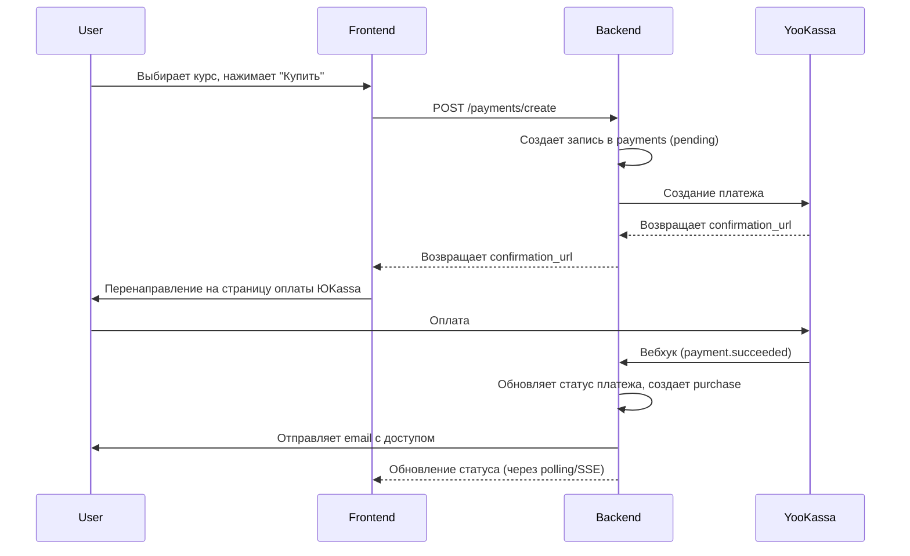
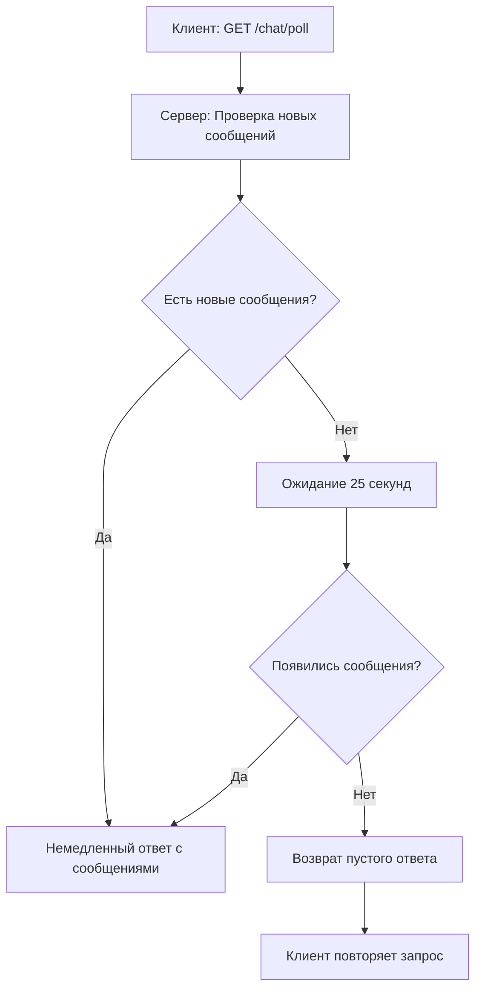

# Архитектурное решение: Образовательная платформа для художницы Перцуковой Веры Олеговны

## Обзор проекта
Преобразование существующего веб-сайта художницы в полноценную образовательную платформу с продажей курсов и мастер-классов по изобразительному искусству.

### Текущий стек
- **Фронтенд**: Nuxt.js (Vue 3, Composition API), TypeScript, Pinia, i18n
- **Бэкенд**: Go (Gin framework), JWT аутентификация
- **База данных**: SQLite (файловая)
- **Инфраструктура**: Статические страницы, галереи работ, новости, магазин

### Цели обновления
1. Добавить систему управления доступом (RBAC) с ролями администратор/пользователь
2. Реализовать продажу курсов и мастер-классов с ограничением по времени
3. Внедрить систему отзывов и рейтингов
4. Добавить асинхронный чат с преподавателем
5. Создать личный кабинет пользователя с прогрессом обучения
6. Разработать админ-панель для управления контентом

---

## 1. Модели данных (Схема SQLite)

### Существующие таблицы (модификации)
```sql
-- 1.1 Расширение таблицы users для RBAC
ALTER TABLE users ADD COLUMN role TEXT NOT NULL DEFAULT 'user';
ALTER TABLE users ADD COLUMN email TEXT;
ALTER TABLE users ADD COLUMN full_name TEXT;
ALTER TABLE users ADD COLUMN created_at TIMESTAMP DEFAULT CURRENT_TIMESTAMP;
ALTER TABLE users ADD COLUMN updated_at TIMESTAMP DEFAULT CURRENT_TIMESTAMP;

-- Индексы для пользователей
CREATE INDEX idx_users_role ON users(role);
CREATE INDEX idx_users_email ON users(email);
```

### Новые таблицы

#### 1.2 Категории продуктов
```sql
CREATE TABLE product_categories (
    id INTEGER PRIMARY KEY AUTOINCREMENT,
    name_ru TEXT NOT NULL,
    name_en TEXT NOT NULL,
    slug TEXT UNIQUE NOT NULL,
    description_ru TEXT,
    description_en TEXT,
    sort_order INTEGER DEFAULT 0,
    is_active BOOLEAN DEFAULT TRUE,
    created_at TIMESTAMP DEFAULT CURRENT_TIMESTAMP,
    updated_at TIMESTAMP DEFAULT CURRENT_TIMESTAMP
);

-- Индексы для категорий
CREATE INDEX idx_product_categories_slug ON product_categories(slug);
CREATE INDEX idx_product_categories_is_active ON product_categories(is_active);
```

#### 1.3 Продукты (курсы и мастер-классы)
```sql
CREATE TABLE products (
    id INTEGER PRIMARY KEY AUTOINCREMENT,
    type TEXT NOT NULL CHECK (type IN ('course', 'masterclass')),
    title_ru TEXT NOT NULL,
    title_en TEXT NOT NULL,
    description_ru TEXT,
    description_en TEXT,
    short_description_ru TEXT,
    short_description_en TEXT,
    price INTEGER NOT NULL, -- в копейках/центах
    duration_days INTEGER, -- срок доступа в днях (NULL = бессрочно)
    thumbnail_url TEXT,
    video_url TEXT,
    status TEXT NOT NULL DEFAULT 'draft' CHECK (status IN ('draft', 'published', 'archived')),
    difficulty TEXT CHECK (difficulty IN ('beginner', 'intermediate', 'advanced')),
    total_lessons INTEGER DEFAULT 0,
    total_duration_minutes INTEGER DEFAULT 0,
    category_id INTEGER, -- ссылка на категорию
    instructor_id INTEGER, -- ссылка на пользователя-преподавателя
    tags JSON, -- массив тегов для поиска и фильтрации
    prerequisites_ru TEXT, -- требования к студентам
    prerequisites_en TEXT,
    learning_outcomes_ru TEXT, -- чему научится студент
    learning_outcomes_en TEXT,
    certificate_available BOOLEAN DEFAULT FALSE, -- выдается ли сертификат
    max_students INTEGER, -- ограничение по количеству студентов (для мастер-классов)
    start_date TIMESTAMP, -- дата начала (для мастер-классов с фиксированной датой)
    language TEXT DEFAULT 'ru' CHECK (language IN ('ru', 'en', 'both')),
    is_featured BOOLEAN DEFAULT FALSE, -- выделенный продукт на главной
    view_count INTEGER DEFAULT 0, -- количество просмотров
    created_at TIMESTAMP DEFAULT CURRENT_TIMESTAMP,
    updated_at TIMESTAMP DEFAULT CURRENT_TIMESTAMP,
    FOREIGN KEY (category_id) REFERENCES product_categories(id) ON DELETE SET NULL,
    FOREIGN KEY (instructor_id) REFERENCES users(id) ON DELETE SET NULL
);

-- Индексы для продуктов
CREATE INDEX idx_products_type ON products(type);
CREATE INDEX idx_products_status ON products(status);
CREATE INDEX idx_products_difficulty ON products(difficulty);
CREATE INDEX idx_products_category_id ON products(category_id);
CREATE INDEX idx_products_instructor_id ON products(instructor_id);
CREATE INDEX idx_products_is_featured ON products(is_featured);
CREATE INDEX idx_products_created_at ON products(created_at);
```

#### 1.4 Уроки/Модули (для курсов)
```sql
CREATE TABLE lessons (
    id INTEGER PRIMARY KEY AUTOINCREMENT,
    product_id INTEGER NOT NULL,
    title_ru TEXT NOT NULL,
    title_en TEXT NOT NULL,
    description_ru TEXT,
    description_en TEXT,
    content_type TEXT NOT NULL CHECK (content_type IN ('video', 'text', 'pdf', 'quiz', 'assignment')),
    content_url TEXT,
    duration_minutes INTEGER DEFAULT 0,
    sort_order INTEGER NOT NULL DEFAULT 0,
    is_preview BOOLEAN DEFAULT FALSE, -- бесплатный превью-урок
    resources JSON, -- массив дополнительных ресурсов: [{"type": "pdf", "url": "...", "title": "..."}]
    homework_ru TEXT, -- задание для самостоятельной работы
    homework_en TEXT,
    estimated_study_time INTEGER, -- рекомендуемое время изучения в минутах
    is_required BOOLEAN DEFAULT TRUE, -- обязательный ли урок
    created_at TIMESTAMP DEFAULT CURRENT_TIMESTAMP,
    updated_at TIMESTAMP DEFAULT CURRENT_TIMESTAMP,
    FOREIGN KEY (product_id) REFERENCES products(id) ON DELETE CASCADE
);

-- Индексы для уроков
CREATE INDEX idx_lessons_product_id ON lessons(product_id);
CREATE INDEX idx_lessons_sort_order ON lessons(product_id, sort_order);
CREATE INDEX idx_lessons_is_preview ON lessons(is_preview);
```

#### 1.5 Покупки (доступ пользователей)
```sql
CREATE TABLE purchases (
    id INTEGER PRIMARY KEY AUTOINCREMENT,
    user_id INTEGER NOT NULL,
    product_id INTEGER NOT NULL,
    purchase_date TIMESTAMP DEFAULT CURRENT_TIMESTAMP,
    access_start TIMESTAMP DEFAULT CURRENT_TIMESTAMP,
    access_end TIMESTAMP, -- NULL для бессрочного доступа
    status TEXT NOT NULL DEFAULT 'active' CHECK (status IN ('active', 'expired', 'cancelled')),
    payment_id INTEGER, -- ссылка на таблицу payments
    promo_code_id INTEGER, -- ссылка на промокод
    price_paid INTEGER NOT NULL, -- фактически уплаченная сумма
    created_at TIMESTAMP DEFAULT CURRENT_TIMESTAMP,
    FOREIGN KEY (user_id) REFERENCES users(id) ON DELETE CASCADE,
    FOREIGN KEY (product_id) REFERENCES products(id) ON DELETE CASCADE
);

-- Индексы для покупок
CREATE INDEX idx_purchases_user_id ON purchases(user_id);
CREATE INDEX idx_purchases_product_id ON purchases(product_id);
CREATE INDEX idx_purchases_access_end ON purchases(access_end);
CREATE INDEX idx_purchases_status ON purchases(status);

-- Триггер для автоматического обновления статуса при истечении срока
CREATE TRIGGER update_purchase_status_after_expiry
AFTER UPDATE OF access_end ON purchases
BEGIN
    UPDATE purchases
    SET status = 'expired'
    WHERE id = NEW.id
    AND NEW.access_end IS NOT NULL
    AND datetime(NEW.access_end) < datetime('now');
END;
```

#### 1.6 Прогресс обучения
```sql
CREATE TABLE learning_progress (
    id INTEGER PRIMARY KEY AUTOINCREMENT,
    user_id INTEGER NOT NULL,
    purchase_id INTEGER NOT NULL,
    lesson_id INTEGER NOT NULL,
    completed BOOLEAN DEFAULT FALSE,
    completed_at TIMESTAMP,
    watch_duration_seconds INTEGER DEFAULT 0,
    last_position_seconds INTEGER DEFAULT 0,
    created_at TIMESTAMP DEFAULT CURRENT_TIMESTAMP,
    updated_at TIMESTAMP DEFAULT CURRENT_TIMESTAMP,
    UNIQUE(user_id, lesson_id),
    FOREIGN KEY (user_id) REFERENCES users(id) ON DELETE CASCADE,
    FOREIGN KEY (purchase_id) REFERENCES purchases(id) ON DELETE CASCADE,
    FOREIGN KEY (lesson_id) REFERENCES lessons(id) ON DELETE CASCADE
);

-- Индексы для прогресса
CREATE INDEX idx_learning_progress_user_purchase ON learning_progress(user_id, purchase_id);
CREATE INDEX idx_learning_progress_completed ON learning_progress(completed);
```

#### 1.7 Отзывы и рейтинги
```sql
CREATE TABLE reviews (
    id INTEGER PRIMARY KEY AUTOINCREMENT,
    user_id INTEGER NOT NULL,
    product_id INTEGER NOT NULL,
    purchase_id INTEGER NOT NULL,
    rating INTEGER NOT NULL CHECK (rating >= 1 AND rating <= 5),
    title_ru TEXT,
    title_en TEXT,
    comment_ru TEXT,
    comment_en TEXT,
    is_approved BOOLEAN DEFAULT FALSE, -- модерация админом
    is_visible BOOLEAN DEFAULT TRUE,
    created_at TIMESTAMP DEFAULT CURRENT_TIMESTAMP,
    updated_at TIMESTAMP DEFAULT CURRENT_TIMESTAMP,
    FOREIGN KEY (user_id) REFERENCES users(id) ON DELETE CASCADE,
    FOREIGN KEY (product_id) REFERENCES products(id) ON DELETE CASCADE,
    FOREIGN KEY (purchase_id) REFERENCES purchases(id) ON DELETE CASCADE
);

-- Индексы для отзывов
CREATE INDEX idx_reviews_product_id ON reviews(product_id);
CREATE INDEX idx_reviews_user_id ON reviews(user_id);
CREATE INDEX idx_reviews_rating ON reviews(rating);
CREATE INDEX idx_reviews_is_approved ON reviews(is_approved);
```

#### 1.8 Чат с преподавателем
```sql
CREATE TABLE chat_threads (
    id INTEGER PRIMARY KEY AUTOINCREMENT,
    purchase_id INTEGER NOT NULL,
    user_id INTEGER NOT NULL,
    admin_id INTEGER, -- ID администратора/преподавателя
    last_message_at TIMESTAMP DEFAULT CURRENT_TIMESTAMP,
    is_resolved BOOLEAN DEFAULT FALSE,
    created_at TIMESTAMP DEFAULT CURRENT_TIMESTAMP,
    FOREIGN KEY (purchase_id) REFERENCES purchases(id) ON DELETE CASCADE,
    FOREIGN KEY (user_id) REFERENCES users(id) ON DELETE CASCADE,
    FOREIGN KEY (admin_id) REFERENCES users(id) ON DELETE SET NULL
);

CREATE TABLE chat_messages (
    id INTEGER PRIMARY KEY AUTOINCREMENT,
    thread_id INTEGER NOT NULL,
    sender_id INTEGER NOT NULL,
    message_type TEXT NOT NULL DEFAULT 'text' CHECK (message_type IN ('text', 'image', 'file')),
    content TEXT NOT NULL,
    attachment_url TEXT,
    attachment_size INTEGER,
    is_read BOOLEAN DEFAULT FALSE,
    read_at TIMESTAMP,
    created_at TIMESTAMP DEFAULT CURRENT_TIMESTAMP,
    FOREIGN KEY (thread_id) REFERENCES chat_threads(id) ON DELETE CASCADE,
    FOREIGN KEY (sender_id) REFERENCES users(id) ON DELETE CASCADE
);

-- Индексы для чата
CREATE INDEX idx_chat_threads_purchase_id ON chat_threads(purchase_id);
CREATE INDEX idx_chat_threads_user_id ON chat_threads(user_id);
CREATE INDEX idx_chat_messages_thread_id ON chat_messages(thread_id);
CREATE INDEX idx_chat_messages_created_at ON chat_messages(thread_id, created_at);
CREATE INDEX idx_chat_messages_is_read ON chat_messages(is_read) WHERE is_read = FALSE;
```

#### 1.9 Платежи (интеграция с ЮKassa)
```sql
CREATE TABLE payments (
    id INTEGER PRIMARY KEY AUTOINCREMENT,
    user_id INTEGER NOT NULL,
    external_id TEXT UNIQUE, -- ID платежа в ЮKassa
    status TEXT NOT NULL CHECK (status IN ('pending', 'waiting_for_capture', 'succeeded', 'canceled', 'refunded')),
    amount INTEGER NOT NULL, -- в копейках
    currency TEXT DEFAULT 'RUB',
    description TEXT,
    payment_method TEXT,
    metadata JSON, -- дополнительные данные
    created_at TIMESTAMP DEFAULT CURRENT_TIMESTAMP,
    updated_at TIMESTAMP DEFAULT CURRENT_TIMESTAMP,
    FOREIGN KEY (user_id) REFERENCES users(id) ON DELETE CASCADE
);

-- Индексы для платежей
CREATE INDEX idx_payments_user_id ON payments(user_id);
CREATE INDEX idx_payments_external_id ON payments(external_id);
CREATE INDEX idx_payments_status ON payments(status);
CREATE INDEX idx_payments_created_at ON payments(created_at);
```

#### 1.10 Промокоды
```sql
CREATE TABLE promo_codes (
    id INTEGER PRIMARY KEY AUTOINCREMENT,
    code TEXT UNIQUE NOT NULL,
    discount_type TEXT NOT NULL CHECK (discount_type IN ('percentage', 'fixed')),
    discount_value INTEGER NOT NULL,
    max_uses INTEGER, -- NULL = без ограничений
    used_count INTEGER DEFAULT 0,
    valid_from TIMESTAMP,
    valid_until TIMESTAMP,
    is_active BOOLEAN DEFAULT TRUE,
    created_at TIMESTAMP DEFAULT CURRENT_TIMESTAMP
);

-- Индексы для промокодов
CREATE INDEX idx_promo_codes_code ON promo_codes(code);
CREATE INDEX idx_promo_codes_is_active ON promo_codes(is_active);
```

---

## 2. API-эндпоинты (Go)

### 2.1 Аутентификация и пользователи (расширение существующих)
| Метод | Путь | Описание | Доступ |
|-------|------|----------|--------|
| POST | `/auth/register` | Регистрация с автоматической ролью 'user' | Публичный |
| POST | `/auth/login` | Вход, получение JWT токенов | Публичный |
| POST | `/auth/refresh` | Обновление access токена | Аутентифицированные |
| GET | `/auth/profile` | Получение профиля пользователя | Аутентифицированные |
| PUT | `/auth/profile` | Обновление профиля | Аутентифицированные |
| GET | `/admin/users` | Список всех пользователей | Admin |
| PUT | `/admin/users/:id/role` | Изменение роли пользователя | Admin |

### 2.2 Продукты (курсы/мастер-классы)
| Метод | Путь | Описание | Доступ |
|-------|------|----------|--------|
| GET | `/products` | Список продуктов с фильтрами | Публичный |
| GET | `/products/:id` | Детали продукта | Публичный |
| POST | `/products` | Создание продукта | Admin |
| PUT | `/products/:id` | Обновление продукта | Admin |
| DELETE | `/products/:id` | Удаление продукта | Admin |
| GET | `/products/:id/lessons` | Уроки продукта | Публичный/Пользователь* |
| GET | `/products/:id/preview` | Бесплатные превью-уроки | Публичный |

### 2.3 Категории продуктов
| Метод | Путь | Описание | Доступ |
|-------|------|----------|--------|
| GET | `/categories` | Список всех категорий | Публичный |
| GET | `/categories/:slug` | Продукты в категории | Публичный |
| GET | `/admin/categories` | Управление категориями (список) | Admin |
| POST | `/admin/categories` | Создание категории | Admin |
| PUT | `/admin/categories/:id` | Обновление категории | Admin |
| DELETE | `/admin/categories/:id` | Удаление категории | Admin |

### 2.4 Покупки и доступ
| Метод | Путь | Описание | Доступ |
|-------|------|----------|--------|
| POST | `/purchases` | Создание покупки (корзина) | User |
| GET | `/purchases` | Мои покупки | User |
| GET | `/purchases/:id` | Детали покупки | User |
| POST | `/purchases/:id/extend` | Продление доступа | User |
| GET | `/purchases/:id/access-check` | Проверка доступа к контенту | User |
| GET | `/admin/purchases` | Все покупки (админ) | Admin |

### 2.5 Обучение и прогресс
| Метод | Путь | Описание | Доступ |
|-------|------|----------|--------|
| GET | `/learning/my-courses` | Мои активные курсы | User |
| GET | `/learning/progress/:purchase_id` | Прогресс по покупке | User |
| POST | `/learning/progress/:lesson_id` | Отметить урок пройденным | User |
| PUT | `/learning/progress/:lesson_id/position` | Сохранить позицию просмотра | User |
| GET | `/learning/:purchase_id/lessons/:lesson_id/content` | Получить контент урока | User* |

### 2.6 Отзывы
| Метод | Путь | Описание | Доступ |
|-------|------|----------|--------|
| GET | `/products/:id/reviews` | Отзывы на продукт | Публичный |
| POST | `/products/:id/reviews` | Оставить отзыв | User (купивший) |
| PUT | `/reviews/:id` | Редактировать отзыв | User (автор) |
| DELETE | `/reviews/:id` | Удалить отзыв | User (автор) или Admin |
| GET | `/admin/reviews/pending` | Отзывы на модерации | Admin |
| PUT | `/admin/reviews/:id/approve` | Одобрить отзыв | Admin |

### 2.7 Чат
| Метод | Путь | Описание | Доступ |
|-------|------|----------|--------|
| GET | `/chat/threads` | Мои чат-треды | User |
| POST | `/chat/threads` | Создать новый тред | User |
| GET | `/chat/threads/:id/messages` | Сообщения треда | User/Admin* |
| POST | `/chat/threads/:id/messages` | Отправить сообщение | User/Admin* |
| POST | `/chat/messages/:id/read` | Отметить как прочитанное | User/Admin* |
| GET | `/admin/chat/threads` | Все активные треды | Admin |
| PUT | `/admin/chat/threads/:id/resolve` | Закрыть тред | Admin |

### 2.8 Платежи (ЮKassa)
| Метод | Путь | Описание | Доступ |
|-------|------|----------|--------|
| POST | `/payments/create` | Создать платеж | User |
| GET | `/payments/:id` | Статус платежа | User |
| POST | `/payments/webhook` | Вебхук от ЮKassa | Публичный (верификация) |
| POST | `/payments/:id/refund` | Возврат платежа | Admin |

### 2.9 Промокоды
| Метод | Путь | Описание | Доступ |
|-------|------|----------|--------|
| POST | `/promo-codes/validate` | Проверка промокода | Публичный |
| GET | `/admin/promo-codes` | Все промокоды | Admin |
| POST | `/admin/promo-codes` | Создать промокод | Admin |
| PUT | `/admin/promo-codes/:id` | Обновить промокод | Admin |

*Примечание: Доступ к контенту уроков проверяется через middleware на наличие активной покупки.

---

## 3. Фронтенд-компоненты (Nuxt.js)

### 3.1 Новые страницы
```
app/pages/
├── courses/                    # Существующие страницы курсов (интегрировать)
│   ├── index.vue              # Каталог всех курсов
│   ├── [id].vue               # Страница курса с деталями
│   └── [id]/lesson/[lessonId].vue # Просмотр урока
├── master-classes/            # Мастер-классы
│   ├── index.vue              # Каталог мастер-классов
│   └── [id].vue               # Страница мастер-класса
├── learning/                  # Личный кабинет обучения
│   ├── index.vue              # Мои курсы
│   ├── [purchaseId].vue       # Детали курса с прогрессом
│   └── cart.vue               # Корзина
├── reviews/                   # Отзывы
│   └── write.vue              # Форма написания отзыва
├── chat/                      # Чат
│   ├── index.vue              # Список чат-тредов
│   └── [threadId].vue         # Чат с преподавателем
└── admin/                     # Админ-панель (расширение)
    ├── products/              # Управление продуктами
    ├── purchases/             # Управление покупками
    ├── reviews/               # Модерация отзывов
    └── chat/                  # Управление чатами
```

### 3.2 Переиспользуемые компоненты
```
app/components/
├── ProductCard.vue            # Карточка курса/мастер-класса
├── LessonPlayer.vue           # Плеер для видео-уроков
├── ProgressTracker.vue        # Трекер прогресса обучения
├── ReviewCard.vue             # Карточка отзыва
├── ReviewForm.vue             # Форма отзыва
├── ChatWidget.vue             # Виджет чата (встраиваемый)
├── AccessChecker.vue          # Компонент проверки доступа
├── PaymentForm.vue            # Форма оплаты (ЮKassa)
└── AdminSidebar.vue           # Боковая панель админки
```

### 3.3 Сторы Pinia (расширение существующих)
```typescript
// stores/ProductStore.ts
interface ProductStore {
  products: Product[]
  currentProduct: Product | null
  lessons: Lesson[]
  // методы загрузки, фильтрации
}

// stores/PurchaseStore.ts
interface PurchaseStore {
  cart: CartItem[]
  purchases: Purchase[]
  activePurchases: Purchase[]
  // методы работы с корзиной, покупками
}

// stores/LearningStore.ts
interface LearningStore {
  progress: Record<string, LessonProgress>
  currentLesson: Lesson | null
  // методы отслеживания прогресса
}

// stores/ChatStore.ts
interface ChatStore {
  threads: ChatThread[]
  currentThread: ChatThread | null
  messages: ChatMessage[]
  unreadCount: number
  // методы long-polling для чата
}

// stores/ReviewStore.ts
interface ReviewStore {
  productReviews: Record<number, Review[]>
  myReviews: Review[]
  // методы работы с отзывами
}
```

### 3.4 Middleware Nuxt
```typescript
// middleware/auth.ts - существующий, расширить проверкой ролей
// middleware/admin.ts - новый, проверка роли admin
// middleware/purchase-access.ts - проверка доступа к курсу
```

---

## 4. Интеграция платежей (ЮKassa)

### 4.1 Схема работы


### 4.2 Безопасность
- Верификация подписи вебхуков от ЮKassa
- Хранение секретного ключа в environment variables
- Логирование всех платежных операций
- Проверка суммы платежа перед активацией доступа

### 4.3 Обработка сценариев
- Успешная оплата → активация доступа на N дней
- Отмена платежа → удаление pending purchase
- Возврат средств → деактивация доступа
- Ожидание подтверждения → статус "waiting_for_capture"

---

## 5. Чат (Long-polling реализация)

### 5.1 Архитектура


### 5.2 Оптимизации для SQLite
- Индексы на `chat_messages(thread_id, created_at)`
- Ограничение истории сообщений (последние 100 на тред)
- Пакетная отправка непрочитанных сообщений
- Кэширование активных тредов в памяти

### 5.3 Уведомления
- Badge с количеством непрочитанных в хедере
- Email-уведомления при новом сообщении от преподавателя
- In-app тосты для важных сообщений

---

## 6. Стратегия проверки доступа к контенту

### 6.1 Middleware в Go
```go
func ContentAccessMiddleware() gin.HandlerFunc {
    return func(c *gin.Context) {
        userID := getUserIdFromContext(c)
        productID := c.Param("product_id")
        lessonID := c.Param("lesson_id")

        // Проверка активной покупки
        var accessEnd sql.NullTime
        err := db.QueryRow(`
            SELECT access_end
            FROM purchases
            WHERE user_id = ? AND product_id = ?
            AND status = 'active'
            AND (access_end IS NULL OR access_end > CURRENT_TIMESTAMP)
        `, userID, productID).Scan(&accessEnd)

        if err != nil {
            c.JSON(403, gin.H{"error": "Доступ запрещен"})
            c.Abort()
            return
        }

        c.Next()
    }
}
```

### 6.2 Альтернатива: подписанные URL
- Генерация временных токенов для защищенного контента
- Срок жизни токена: 1 час для видео, 24 часа для PDF
- Проверка подписи на CDN/nginx уровне

### 6.3 Кэширование проверок
- Redis/memory cache для частых запросов
- TTL: 5 минут для активных сессий

---

## 7. Миграция с существующей БД

### 7.1 Поэтапный план
```sql
-- Фаза 1: Добавление ролей пользователям
ALTER TABLE users ADD COLUMN role TEXT NOT NULL DEFAULT 'user';

-- Существующих пользователей делаем user
UPDATE users SET role = 'user' WHERE role IS NULL;

-- Назначение администратора (вручную)
UPDATE users SET role = 'admin' WHERE username = 'admin_username';

-- Фаза 2: Создание новых таблиц (продукты, покупки и т.д.)
-- Выполнить все CREATE TABLE из раздела 1

-- Фаза 3: Миграция существующих курсов (если есть)
-- Предполагаем, что текущие страницы курсов статические
-- Нужно создать соответствующие записи в products и lessons
```

### 7.2 Рекомендации по миграции
1. **Бэкап перед изменениями**: `sqlite3 db.sqlite .dump > backup.sql`
2. **Постепенное развертывание**: Сначала новая функциональность, потом интеграция
3. **Двойной запуск**: Старый и новый API параллельно во время миграции
4. **Откат**: Скрипт отката миграций должен быть подготовлен

---

## 8. Риски и компромиссы

### 8.1 Ограничения SQLite
| Риск | Смягчение | Долгосрочное решение |
|------|-----------|---------------------|
| Конкурентность на запись | Очередь запросов на уровне приложения | Миграция на PostgreSQL |
| Отсутствие полноценных транзакций | Использование `BEGIN IMMEDIATE` | |
| Ограничения масштабирования | Репликация только для чтения | Кластерная БД |
| Ручное управление индексами | Тщательное проектирование индексов | Автоматическая оптимизация |

### 8.2 Безопасность
- **Чат/файлы**: Проверка MIME-типов, ограничение размера (10MB), антивирусное сканирование
- **Платежи**: Изоляция платежного модуля, аудит всех операций
- **Данные пользователей**: Шифрование чувствительных данных, GDPR compliance

### 8.3 Производительность
- **Кэширование**: Redis для часто запрашиваемых данных (каталог курсов, отзывы)
- **CDN**: Для видео-контента и статических файлов
- **Оптимизация запросов**: N+1 проблема решается через JOINs и предзагрузку

---

## 9. План внедрения и приоритеты

### 9.1 Фаза 1: Базовая функциональность (2-3 недели)
1. **Расширение пользователей**: Добавление ролей, обновление JWT claims
2. **Модели продуктов**: Таблицы products, lessons, миграция
3. **API продуктов**: CRUD для админа, каталог для пользователей
4. **Система покупок**: Таблицы purchases, базовый доступ

### 9.2 Фаза 2: Оплата и доступ (3-4 недели)
1. **Интеграция ЮKassa**: Платежи, вебхуки, активация доступа
2. **Личный кабинет**: Мои курсы, прогресс обучения
3. **Проверка доступа**: Middleware, защита контента
4. **Промокоды**: Система скидок

### 9.3 Фаза 3: Социальные функции (2-3 недели)
1. **Отзывы и рейтинги**: CRUD, модерация, отображение
2. **Чат**: Long-polling, интерфейс, уведомления
3. **Админ-панель**: Управление контентом, модерация

### 9.4 Фаза 4: Оптимизация и улучшения (1-2 недели)
1. **Производительность**: Кэширование, индексы, оптимизация
2. **UX улучшения**: Рекомендации, email-уведомления
3. **Аналитика**: Статистика продаж, прогресса пользователей

### 9.5 Оценка сложности
- **Бэкенд**: ~15 человеко-дней
- **Фронтенд**: ~20 человеко-дней
- **Интеграции**: ~5 человеко-дней
- **Тестирование и деплой**: ~5 человеко-дней
- **Итого**: ~45 человеко-дней

---

## 10. Рекомендации для команды разработки

### 10.1 Технический долг
1. **Монолит → микросервисы**: Выделить платежный модуль при росте
2. **SQLite → PostgreSQL**: Планировать миграцию при >100 активных пользователей
3. **Long-polling → WebSockets**: При необходимости real-time чата

### 10.2 Мониторинг
- **Метрики**: Количество покупок, активных пользователей, средний чек
- **Логирование**: Все платежные операции, ошибки доступа
- **Алерты**: Сбои платежей, истечение SSL сертификатов

### 10.3 Масштабирование
- **Вертикальное**: Увеличение ресурсов сервера
- **Горизонтальное**: Балансировка нагрузки, репликация БД
- **Геораспределение**: CDN для статики, региональные платежные шлюзы

---

## Заключение

Данное архитектурное решение предоставляет полный план преобразования существующего сайта художницы в образовательную платформу. Ключевые преимущества:

1. **Поэтапное внедрение** позволяет минимизировать риски
2. **Использование существующего стека** сокращает время разработки
3. **Модульность архитектуры** облегчает будущие расширения
4. **Баланс функциональности и простоты** соответствует ресурсам малой команды

Документ готов к использованию в качестве технического задания для команды разработки.
