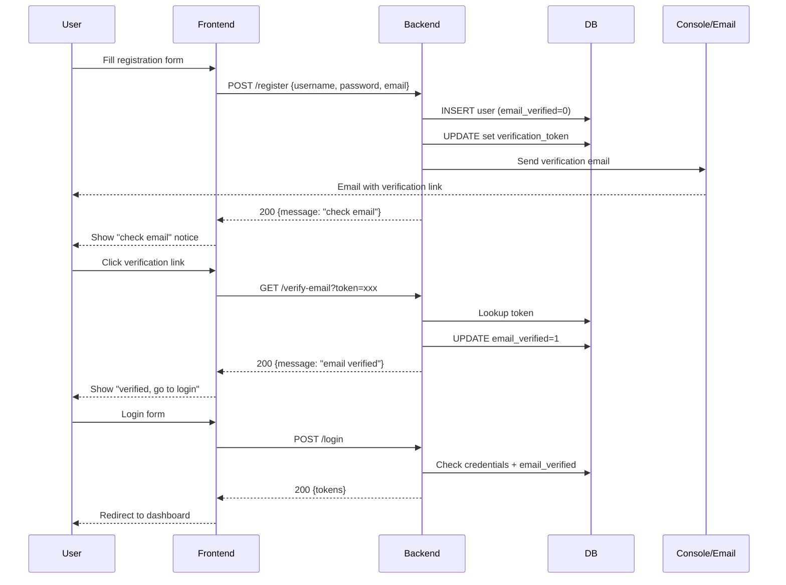

# Email Verification Feature Plan

## Overview

Implement email verification for new user registrations. After registration, the user account is created in an **unverified** state. A verification token is generated and "sent" to the user's email. The user must click the verification link to activate their account before they can log in.

---

## 1. Database Changes

### Migration: Add columns to `users` table

```sql
ALTER TABLE users ADD COLUMN email_verified INTEGER NOT NULL DEFAULT 0;
ALTER TABLE users ADD COLUMN verification_token TEXT;
ALTER TABLE users ADD COLUMN verification_token_expires_at TIMESTAMP;
```

- `email_verified` — 0 = unverified, 1 = verified
- `verification_token` — cryptographically random token (hex-encoded, 32 bytes → 64 chars)
- `verification_token_expires_at` — token expiry (24 hours from creation)

### Index for fast token lookup

```sql
CREATE INDEX idx_users_verification_token ON users(verification_token);
```

---

## 2. Backend Changes

### 2.1 SMTP Configuration

**File: [`server/config.yaml`](server/config.yaml)** — Add SMTP section:

```yaml
smtp:
  host: "smtp.example.com"
  port: 587
  username: "noreply@example.com"
  password: ""
  from: "noreply@example.com"
  from_name: "Vera Art"
```

**File: [`server/internal/config/config.go`](server/internal/config/config.go)** — Add `SMTPConfig` struct:

```go
type SMTPConfig struct {
    Host     string `mapstructure:"host"`
    Port     int    `mapstructure:"port"`
    Username string `mapstructure:"username"`
    Password string `mapstructure:"password"`
    From     string `mapstructure:"from"`
    FromName string `mapstructure:"from_name"`
}
```

Add to `Config` struct:
```go
type Config struct {
    App         AppConfig
    CORS        CORSConfig
    Directories DirectoriesConfig
    SMTP        SMTPConfig
}
```

### 2.2 Email Service

**New file: [`server/email.go`](server/email.go)**

- `SendVerificationEmail(to, token string) error` — sends verification email
- Uses `net/smtp` for SMTP
- In dev mode (no SMTP configured), logs the verification URL to console
- Verification URL format: `http://localhost:3000/auth/verify-email?token={token}`

### 2.3 Token Generation Utility

**New function in [`server/auth.go`](server/auth.go)** or new file:

- `generateVerificationToken() (string, time.Time, error)` — generates 32 random bytes, hex-encodes them, sets expiry to 24 hours

### 2.4 Updated Register Handler

**File: [`server/auth.go`](server/auth.go) — `Register` function**

Changes:
1. After successful INSERT, generate verification token
2. UPDATE the user row with `verification_token` and `verification_token_expires_at`
3. Call `SendVerificationEmail(email, token)`
4. Return success response with message: "Registration successful! Please check your email to verify your account."

### 2.5 New Verify Email Endpoint

**File: [`server/auth.go`](server/auth.go) — new `VerifyEmail` handler**

- Route: `GET /verify-email?token={token}`
- Look up user by `verification_token`
- Check token hasn't expired
- Set `email_verified = 1`, clear `verification_token` and `verification_token_expires_at`
- Return success response
- Handle errors: invalid token, expired token, already verified

### 2.6 New Resend Verification Endpoint

**File: [`server/auth.go`](server/auth.go) — new `ResendVerification` handler**

- Route: `POST /resend-verification`
- Request body: `{ "email": "..." }`
- Look up user by email
- Check if already verified
- Generate new token, update DB
- Send new verification email
- Return success (always return success to prevent email enumeration)

### 2.7 Updated Login Handler

**File: [`server/auth.go`](server/auth.go) — `Login` function**

After password validation, add check:
```go
if !user.EmailVerified {
    logSecurityEvent("login_failed", ...)
    c.JSON(http.StatusForbidden, gin.H{
        "error": "account not verified",
        "code":  "email_not_verified",
        "email": user.Email,
    })
    return
}
```

### 2.8 Route Registration

**File: [`server/main.go`](server/main.go)**

Add routes:
```go
r_gin.GET("/verify-email", VerifyEmail)
r_gin.POST("/resend-verification", RateLimitMiddleware(), ResendVerification)
```

### 2.9 User Model Update

**File: [`server/models/user.go`](server/models/user.go)**

Add fields:
```go
EmailVerified          bool      `json:"email_verified"`
VerificationToken      string    `json:"-"`
VerificationTokenExpiresAt time.Time `json:"-"`
```

### 2.10 DTO Updates

**File: [`server/dtos/user.go`](server/dtos/user.go)**

Add:
```go
type ResendVerificationRequest struct {
    Email string `json:"email" binding:"required,email"`
}
```

---

## 3. Frontend Changes

### 3.1 API Client Update

**File: [`client/app/api/auth.ts`](client/app/api/auth.ts)**

Add methods:
```typescript
async verifyEmail(token: string): Promise<any>
async resendVerification(email: string): Promise<any>
```

### 3.2 Registration Page Update

**File: [`client/app/pages/auth/register.vue`](client/app/pages/auth/register.vue)**

After successful registration:
- Show success alert with message: "Registration successful! A verification link has been sent to your email."
- Hide the form
- Show a "Resend email" button
- Auto-redirect to login after 5 seconds (instead of 2)

### 3.3 New Verification Page

**New file: [`client/app/pages/auth/verify-email.vue`](client/app/pages/auth/verify-email.vue)**

- Reads `token` from URL query parameter
- Calls `GET /verify-email?token={token}`
- Shows loading state
- On success: shows success message with "Go to login" button
- On failure: shows error message with "Resend verification" link

### 3.4 Login Page Update

**File: [`client/app/pages/auth/login.vue`](client/app/pages/auth/login.vue)**

When login fails with `code: "email_not_verified"`:
- Show specific error: "Please verify your email before logging in"
- Show "Resend verification email" button
- The button calls `POST /resend-verification` with the user's email

---

## 4. Security Considerations

1. **Token entropy**: 32 bytes (256 bits) from `crypto/rand` — cryptographically secure
2. **Token expiry**: 24 hours — limits window of vulnerability
3. **Rate limiting**: Apply rate limiting to `/resend-verification` (same as login/register)
4. **No email enumeration**: `/resend-verification` always returns success (even if email doesn't exist)
5. **Token cleanup**: Tokens are cleared after successful verification (one-time use)
6. **Login blocked**: Unverified accounts cannot log in

---

## 5. Development Mode

Since there's no real SMTP server in development:
- The email service will detect missing SMTP config
- It will log the verification URL to the server console
- Example: `[EMAIL] Verification URL: http://localhost:3000/auth/verify-email?token=abc123...`
- This allows testing by copying the URL from the console

---

## 6. Flow Diagram



---

## 7. Implementation Order

1. Database migration (add columns + index)
2. SMTP config (config.yaml + config.go)
3. Email service (email.go)
4. Token generation utility
5. Update Register handler
6. Create VerifyEmail handler
7. Create ResendVerification handler
8. Update Login handler
9. Register new routes in main.go
10. Update User model
11. Add DTOs
12. Update frontend API client
13. Update register.vue
14. Create verify-email.vue
15. Update login.vue
16. Update db-schema.md
